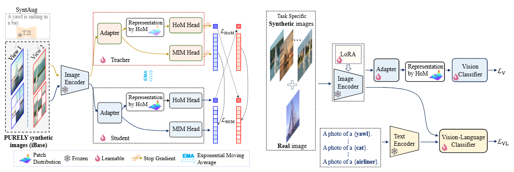

<h1 align="center">ImagineFSL: Self-Supervised Pretraining Matters on Imagined Base Set for VLM-based Few-shot Learning</h1>

<h3 align="center">Haoyuan Yang &nbsp;&nbsp; Xiaoou Li &nbsp;&nbsp; Jiaming Lv &nbsp;&nbsp; Xianjun Cheng &nbsp;&nbsp; Qilong Wang &nbsp;&nbsp; Peihua Li</h3>


<h3 align="center">CVPR 2025</h3>

<h4 align="center">
    <a href="https://arxiv.org/abs/2412.08139">[Paper]</a> •
    <a href="http://peihuali.org/ImagineFSL">[Project]</a>
</h4>

<div align="center"></div>

## Introduction

In this paper:

- We frame synthetic images as standalone knowledge repositories and present **a CLIP adaptation methodology** that pretrains on purely synthetic images before fine-tuning for few-shot tasks.
- We propose **an improved Self-SL method** based on DINO. It introduces higher-order moments for image representation and employs synthetic augmentation for effective view construction.
- We develop **a systematic and scalable pipeline** for synthesizing both captions and images, enabling generation of large-scale base sets for pretraining and task-specific datasets.

## Dataset

- iBase Dataset:
  
  The iBase dataset used for pretraining can be downloaded from [here](https://).

- 10 Datasets (Real Images):

  We provide download links for the 10 datasets used in our experiments (except ImageNet). 
  
   [Baidu Yun](https://pan.baidu.com/s/17k-xFrEtBdwh8taFtPcpwg?pwd=7fm5) (code: 7fm5)

   [Google Drive](https://)


  These datasets are identical to those provided by [CoOp](https://github.com/KaiyangZhou/CoOp/blob/main/DATASETS.md) but with standardized file organization for PyTorch compatibility.

## Installation

All our experiments are conducted on a PC with an Intel Core i9-13900K CPU and GeForce RTX 4090 GPUs.

### 1. Clone this repo:

```
git clone https://github.com/ImagineFSL/ImagineFSL.git
cd ImagineFSL
```

### 2. Environments:

We conduct experiments using PyTorch 2.2.2 and Python 3.10. The CUDA used is 12.1

Install the corresponding PyTorch version using:

```
pip install torch==2.2.2 torchvision==0.17.2 torchaudio==2.2.2 --index-url https://download.pytorch.org/whl/cu121
```

Install other dependencies using:

```
pip install -r requirements.txt
```

**Note**: We use Facebook's xformers to accelerate Attention computation. Different hardware environments may require different versions. We provide the xformers installation command in requirements.txt, but successful installation is not guaranteed (verified working on RTX 4090 and 3090). If installation fails, try different versions.

## Getting started

### 1. Synthesizing Captions & Images

Run the following command to get into the synthesizing directory:

```
cd synthesizing
```

<h3> Require Factors by GPT </h3>

For example, to synthesize attributes:
```
python syn_attribute.py \
--api_key YOUR API_KEY \
--model gpt-4o \
--dataset DATASET_NAME \ 
``` 

You need to register an account on [OpenAI](https://platform.openai.com/docs/guides/authentication) and obtain an API_KEY. For more details, refer to the [OpenAI API documentation](https://platform.openai.com/docs/guides/authentication).

<h3> Synthesize Examples </h3>

Run the following command to synthesize examples:

```
python syn_examples.py \
--api_key YOUR API_KEY \
--model gpt-4o \
--dataset DATASET_NAME \ 
``` 

<h3> Synthesize Captions </h3>

We use Llama 3 to synthesize text. The Llama 3 weight files can be downloaded [here](http://).

Get into the Llama 3 directory:

```
cd synthesizing/llama_syn
```

Install additional dependencies required for Llama 3 inference:

```
fire==0.3.0
fairscale==0.4.13
tiktoken==0.7.0
blobfile==0.3.0
tqdm==4.66.5
```

Run the following command:

```
python syn_examples.py
```

<h3> Synthesize Images </h3>

We use Stable Diffusion 3 Medium accelerated by TensorRT to synthesize images. Refer to the [NVIDIA provided example](https://github.com/NVIDIA/TensorRT/tree/release/10.8/demo/Diffusion) for details.

----
### 2. Pretraining  

Use the following command for pretraining:

```
sh run.sh
```

Configuration file: dinov2/config/train/clip_b16.yaml

Note: You need to specify the dataset path for pretraining in the configuration file.

We provide download links for the pretrained models:

- CLIP-ViT-B/16: [https://](https://)
- CLIP-ViT-L/14: [https://](https://)

----

### 3. Few-shot Fine-tuning

**ImagineFSL**:

```
sh run_ct.sh
```
Set the configuration file in  xxx.py and dataset path in the xxx.py.

**ImagineFSL$_\text{LoRA}$**:

```
sh run_ct_lora.sh
```

Set the configuration file in  xxx.py and dataset path in the xxx.py.

We provide download links for the fine-tuned models (ViT-B/16) across 11 datasets:

- ImagineFSL: [https://](https://)
- ImagineFSL$_\text{LoRA}$: [Coming soon.](http://)

**Note that the results is slightly different to the results in paper due to randomness in traning.**

**We recommend evaluated all methods and models across 11 datasets.**

----

### 4. Evaluation

Code for evalution only is coming soon...

## Acknowledgement

- Thanks for CoOp (Dataset), DINOv2 (Pretraining), DISEF (Fine-tuning), SynCLR (Synthesizing Text).
- Thanks also go to authors of other papers who make their code publicly available.

## Citation

If this repo is helpful for your research, please consider citing the paper:

```BibTeX
@InProceedings{ImagineFSL_CVPR25,
    author    = {Yang, Haoyuan and Li, Xiaoou and Lv, Jiaming and Cheng, Xianjun and Wang, Qilong and Li, Peihua},
    title     = {ImagineFSL: Self-Supervised Pretraining Matters on Imagined Base Set for VLM-based Few-shot Learning},
    booktitle = {Proceedings of the IEEE/CVF Conference on Computer Vision and Pattern Recognition},
    year      = {2025},
}
```

## Contact

If you have any questions or suggestions, please contact us:

- Haoyuan Yang (yanghaoyuan@mail.dlut.edu.cn)
- Xiaoou Li (xiaoouli@bupt.edu.cn)
- Jiaming Lv (ljm_vlg@mail.dlut.edu.cn)
