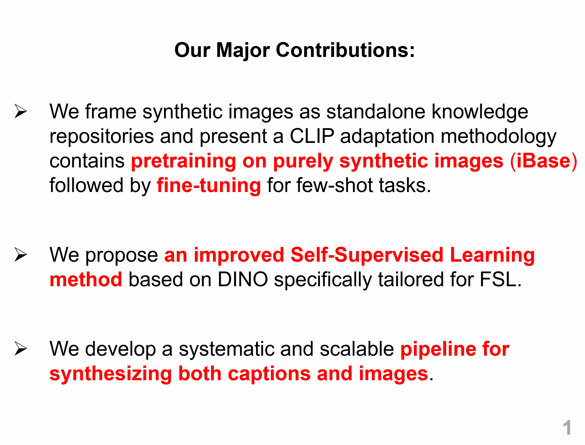

<h1 align="center">ImagineFSL: Self-Supervised Pretraining Matters on Imagined Base Set for VLM-based Few-shot Learning</h1>

<!-- <h3 align="center">Haoyuan Yang &nbsp;&nbsp; Xiaoou Li &nbsp;&nbsp; Jiaming Lv &nbsp;&nbsp; Xianjun Cheng &nbsp;&nbsp; Qilong Wang &nbsp;&nbsp; Peihua Li</h3> -->

<!-- <h5 align="center">Dalian University of Technology &nbsp; Beijing University of Posts and Telecommunications &nbsp; Tianjin University</h5> -->

<h3 align="center">CVPR 2025 (Highlight)</h3>

<!--h3 align="center">
    <a href="https://cvpr.thecvf.com/virtual/2025/poster/32717">[Paper]</a> •
    <a href="http://peihuali.org/ImagineFSL">[Project]</a>
</h3-->

<div align="center"></div>

## Introduction

In this paper:

- We frame synthetic images as standalone knowledge repositories and present **a CLIP adaptation methodology** that pretrains on purely synthetic images before fine-tuning for few-shot tasks.
- We propose **an improved Self-SL method** based on DINO. It introduces higher-order moments for image representation and employs synthetic augmentation for effective view construction.
- We develop **a systematic and scalable pipeline** for synthesizing both captions and images, enabling generation of large-scale base sets for pretraining and task-specific datasets.

## Dataset

- **iBase Dataset**:
  
  The iBase dataset used for pretraining can be downloaded from 
  
  [`Baidu Yun`](https://pan.baidu.com/s/1-a4oFKiPFdD_QRGJqAN9jA?pwd=r9ur) | [`OneDrive`](https://maildluteducn-my.sharepoint.com/:u:/g/personal/yanghaoyuan_mail_dlut_edu_cn/EW67Bo9jyf5LtfQRjpFCnucB8wnoL3kPfCno4nGNSB5YHA?e=DFflEj)

- **10 Downstream Datasets (Real Images)**:

  We provide download links for the 10 datasets used in our experiments (except ImageNet). 
  
   [`Baidu Yun`](https://pan.baidu.com/s/17k-xFrEtBdwh8taFtPcpwg?pwd=7fm5) | [`OneDrive`](https://maildluteducn-my.sharepoint.com/:f:/g/personal/yanghaoyuan_mail_dlut_edu_cn/Emd9FEmohW9Mkj392CH8zjcBVnz1BmYTGNZHEIX3gjhdpg?e=WnChnu)


  *These datasets are identical to those provided by [`CoOp`](https://github.com/KaiyangZhou/CoOp/blob/main/DATASETS.md) but with standardized file organization for PyTorch compatibility*.

## Installation

All our experiments are conducted on a PC with an Intel Core i9-13900K CPU and GeForce RTX 4090 GPUs.

### 1. Clone this repo:

```
git clone https://github.com/HaoyuanYang-2023/ImagineFSL.git
cd ImagineFSL
```

### 2. Environments:

> For the stability and reproducibility of code execution, we highly recommend using the following environment for experiments.

We conduct experiments using PyTorch 2.2.2 and Python 3.10. The CUDA used is 12.1.

Install the corresponding PyTorch version using:

```
pip install torch==2.2.2 torchvision==0.17.2 torchaudio==2.2.2 --index-url https://download.pytorch.org/whl/cu121
```

Install other dependencies using:

```
pip install -r requirements.txt
```

**Note**: We use Facebook's xformers to accelerate Attention computation. Different hardware environments may require different versions. We provide the xformers installation command in requirements.txt, but successful installation is not guaranteed (verified working on RTX 4090 and 3090). If installation fails, try different versions.

## Getting started

### 1. Synthesizing Captions & Images

Run the following command to get into the synthesizing directory:

```
cd synthesizing
```

<h3> Require Factors by GPT </h3>

For example, to synthesize attributes:
```
python syn_attribute.py \
--api_key YOUR API_KEY \
--model gpt-4o \
--dataset DATASET_NAME \ 
``` 

You need to register an account on [`OpenAI`](https://platform.openai.com/docs/overview) and obtain an API_KEY. For more details, refer to the [`OpenAI API documentation`](https://platform.openai.com/docs/quickstart).

<h3> Synthesize Examples </h3>

Run the following command to synthesize examples:

```
python syn_examples.py \
--api_key YOUR API_KEY \
--model gpt-4o \
--dataset DATASET_NAME \ 
``` 

<h3> Synthesize Captions </h3>

We use Llama 3 8B to synthesize text. The weight files of Llama 3 8B can be downloaded [`here`](https://huggingface.co/meta-llama/Meta-Llama-3-8B/tree/main/original).

Install additional dependencies required for Llama 3 inference:

```
fire==0.3.0
fairscale==0.4.13
tiktoken==0.7.0
blobfile==0.3.0
```

Run the following command:

```
LLAMA_FOLDER=YOUR_LLAMA_FOLDER

torchrun --nproc_per_node 1 --master_port 12388 \
    syn_captions.py --ckpt_dir ${LLAMA_FOLDER} --tokenizer_path ${LLAMA_FOLDER}/tokenizer.model \
    --max_batch_size 16 --max_seq_len 400 --max_gen_len 100 \
    --total_captions 300 --seed 0 --category DATASET_NAME --temperature 0.8
```

<h3> Synthesize Images </h3>

We use Stable Diffusion 3 Medium accelerated by TensorRT to synthesize images. Refer to the [`provided example by NVIDIA`](https://github.com/NVIDIA/TensorRT/tree/release/10.8/demo/Diffusion) for details.

----
### 2. Pretraining  

Use the following command for pretraining:

```
sh run_pretrain.sh
```

Configuration file: 
```
dinov2/config/train/clip_b16.yaml
```

**Note**: You need to specify the dataset path for pretraining in the configuration file.

We provide download links for the pretrained models:

- ViT-B/16: [`Baidu Yun`](https://pan.baidu.com/s/1i3txwvzpx9yJeGj8AFTZrw?pwd=app9) | [`Google Drive`](https://drive.google.com/file/d/1-5s6-RpLLTzbrZXbHyfPWSuLqQ3Qq4WG/view?usp=drive_link)

- ViT-L/14: [`Baidu Yun`](https://pan.baidu.com/s/1Ac8UqmtKnR9wFVhXeTjrbg?pwd=pp64) | [`Google Drive`](https://drive.google.com/file/d/1-5Zi1BrIPQW_iCwVvJ7wXIS1OlfWjShT/view?usp=drive_link)
   
----

### 3. Few-shot Fine-tuning

**ImagineFSL**:

Set the pretrain model path in the following shell script and run it: 
```
sh run_imaginefsl.sh
```
You need to set the dataset path in the `dinov2/eval/ct_tuning_mixing.py` first.

For evaluation, run the following command:

```
sh run_imaginefsl_eval.sh
```
You need to specify the path to vision classifier, adapter, text classifier and pretrained model weights in the shell, and set the corresponding fusion weight and temperature optimized in the previous step.

**ImagineFSL_LoRA**:


Set the pretrain model path in the following shell script and run it: 
```
sh run_imaginefsl_lora.sh
```
You need to set the dataset path in the `dinov2/eval/ct_lora_tuning_mixing.py` first.

For evaluation, run the following command:

```
sh run_imaginefsl_lora_eval.sh
```
You need to specify the path to vision model, vision classifier, adapter, text classifier and pretrained model weights in the shell, and set the corresponding fusion weight, rank.

We provide download links for fine-tuned models on 1-/16-shot settings (ViT-B/16) across 11 datasets:

|Method|1-shot|16-shot|
|:-|:-:|:-:|
|ImagineFSL| 76.1 \| [`Baidu Yun`](https://pan.baidu.com/s/1Jpu45g3S3VizXuoz9_NMzQ?pwd=r5eq) \| [`Google Drive`](https://drive.google.com/drive/folders/1-6-kHsgYmXJAwbBn0HV4A2nYkd2bBgva?usp=drive_link)| 86.4 \| [`Baidu Yun`](https://pan.baidu.com/s/1JMLmzoJ8AqKRyV_ONv9vVg?pwd=5i5f) \| [ `Google Drive`](https://drive.google.com/drive/folders/1-5MMNE69OQKCcAMqwCpVeX0hyfn7kt6W?usp=drive_link) |
|ImagineFSL_LoRA|77.6 \| [`Baidu Yun`](https://pan.baidu.com/s/11P61q63LVbxxiX3ZsORpVA?pwd=a9md) \| [`Google Drive`](https://drive.google.com/drive/folders/10I_kpcFId7JQgByAgKasMeWsm7GaYq95?usp=sharing) | 87.6 \| [`Baidu Yun`]( https://pan.baidu.com/s/15XSGTHI_vF1sjCMgfELJAg?pwd=13ev) \| [`Google Dribe`]()|
|||

Detailed results of All K-shot settings can be found in [`here`](https://github.com/HaoyuanYang-2023/ImagineFSL/tree/main/results).

**Note: Due to randomness, the results may slightly differ from those in the paper. We recommend evaluating all methods and models across 11 datasets to observe the average performance.**


## Acknowledgement

- Thanks for the authors of CoOp (Dataset), DINOv2 (Pretraining), DISEF (Fine-tuning), SynCLR (Synthesizing captions).
- Thanks also go to authors of other papers who make their code publicly available.

## Citation

If this repo is helpful for your research, please consider citing the paper:

```BibTeX
@InProceedings{ImagineFSL_CVPR25,
    author    = {Haoyuan, Yang and Xiaoou, Li and Jiaming, Lv and Xianjun, Cheng and Qilong, Wang and Peihua, Li},
    title     = {ImagineFSL: Self-Supervised Pretraining Matters on Imagined Base Set for VLM-based Few-shot Learning},
    booktitle = {Proceedings of the IEEE/CVF Conference on Computer Vision and Pattern Recognition},
    year      = {2025},
}
```

## Contact

If you have any questions or suggestions, please contact us:

- Haoyuan Yang (yanghaoyuan@mail.dlut.edu.cn)
<!-- - Xiaoou Li (xiaoouli@bupt.edu.cn)
- Jiaming Lv (ljm_vlg@mail.dlut.edu.cn) -->
